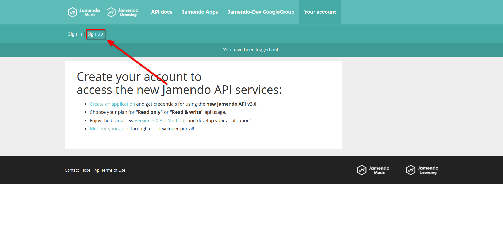
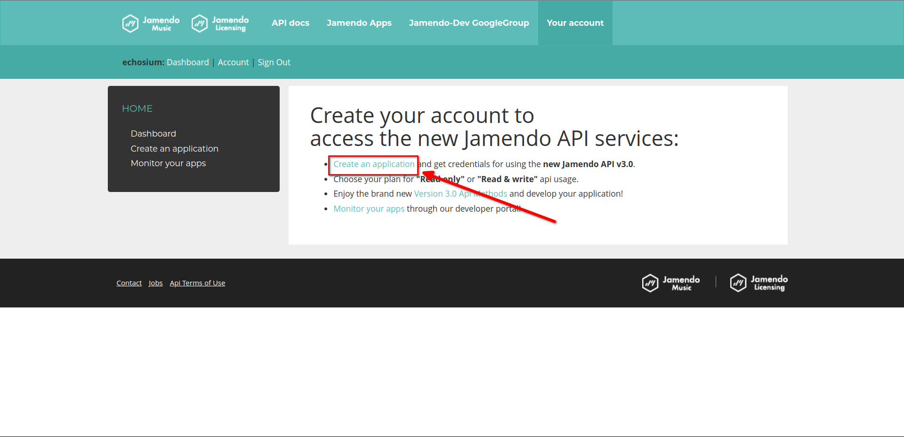

## How to Obtain a Jamendo API Key

To use Echosium, you'll need a Jamendo API key. Follow the steps below to create your key:

### 1. Visit the Jamendo Developer Portal

- Open your browser and go to the [Jamendo Developer Portal](https://developer.jamendo.com).

  

### 2. Log In or Create an Account

- If you already have a Jamendo account, log in.
- If you don’t have an account, click **Your Account** then **Sign Up** and follow the instructions to create one.

  

### 3. Create a New Application

- Once logged in click on **Create an App**.
- Then you will find already an App created for you and you can use the client_id of it and put it in `config file`.

  

---
