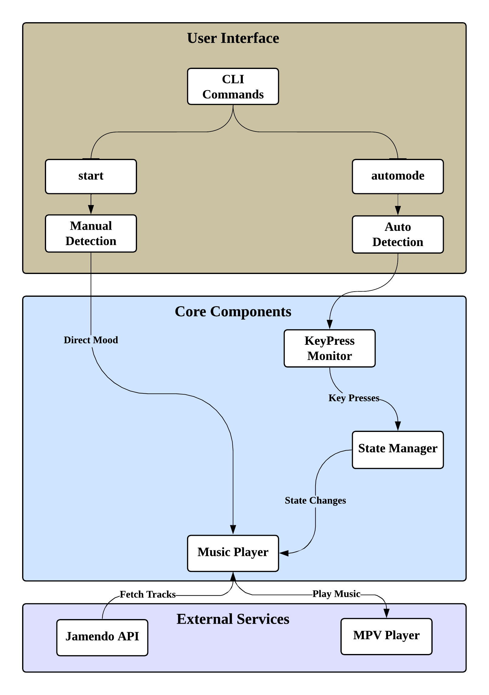
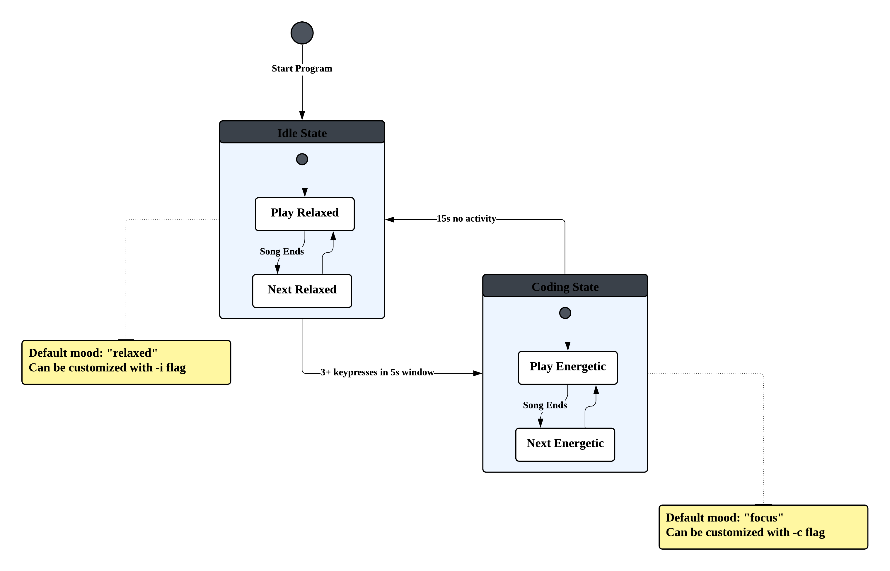

## Echosium System Architecture and Flow

    
    
<strong>Echosium System Architecture</strong>

## Echosium State Transitioning Flow

    
    
<strong>Echosium State Transitioning Flow</strong>

